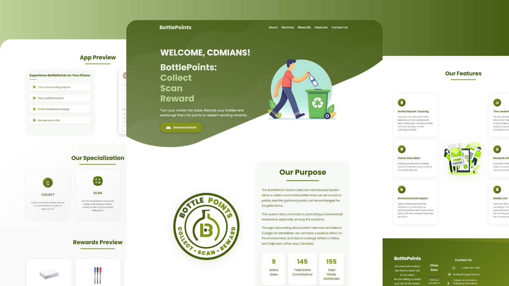

<div align="center">

  <br />
  <br />

  <h2 align="center">BottlePoints Website</h2>

  This is fully responsive website. <br />Responsive for all devices, built using HTML, CSS, and JavaScript.

</div>

<br />

### Demo Screeshots



### Prerequisites

Before you begin, ensure you have met the following requirements:

* [Git](https://git-scm.com/downloads "Download Git") must be installed on your operating system.

### Run Locally

To run **Desinic** locally, run this command on your git bash:

Linux and macOS:

```bash
sudo git clone https://github.com/beelogss/BP-website.git
```

Windows:

```bash
git clone https://github.com/beelogss/BP-website.git
```

### License

This project is **free to use** and does not contains any license.
